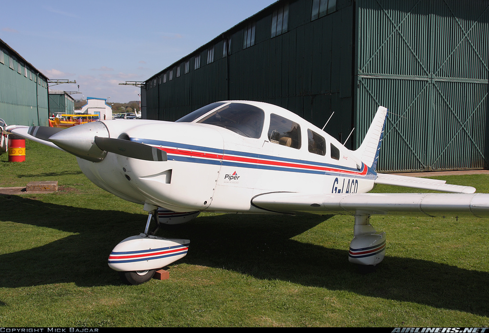

# Attribute Phrases
This is the dataset and the training code with Tensorflow used in the paper:

Jong-Chyi Su*, Chenyun Wu*, Huaizu Jiang, Subhransu Maji, "Reasoning about Fine-grained Attribute Phrases using Reference Games", International Conference on Computer Vision (ICCV), 2017

	@inproceedings{su2017reasoning,
	    Author = {Jong-Chyi Su and Chenyun Wu and Huaizu Jiang and Subhransu Maji},
	    Title = {Reasoning about Fine-grained Attribute Phrases using Reference Games},
	    Booktitle = {International Conference on Computer Vision (ICCV)},
	    Year = {2017}
	}

[[Project page]](http://people.cs.umass.edu/~jcsu/papers/visdiff)
[[Paper]](http://people.cs.umass.edu/~jcsu/papers/visdiff/visdiff.pdf)

## Dataset
Each pair has 1 pair of images and 5 pairs of corresponding attribute phrases 

Image 1                    |    |  Image 2
:-------------------------:|:--:|:-------------------------:
 | | 
commercial plane |__vs__| private plane
large plane |__vs__| small plane
white and grey |__vs__| white with blue and red stripes
twin engines |__vs__| single engine
more windows on body |__vs__| less windows on body

### Stats about the dataset
- Training set: 4700 pairs
- Val set: 2350 pairs
- Test set: 2350 pairs

## Requirements
- Python 2.7
- Tensorflow v1.0+

## Download Dataset
- User descriptions are included in `dataset/visdiff\_SET.json`, where SET={train, val, test, trainval}
- Download images from OID dataset (http://www.robots.ox.ac.uk/~vgg/data/oid)
- Move images from `oid-aircraft-beta-1/data/images/aeroplane/\*.jpg` to the folder `dataset/images/\*.jpg`

## Download ImageNet Pre-trained Model
Add pretrained model (e.g. vgg_16.ckpt) in `models/checkpoints/`

## Extract image feature to numpy file to accelerate training
Go to `utils/` and run:
`python get_feature.py --dataset train`
the numpy file will be saved in `img_feat/vgg_16/train.npy`

## Train Listener Model
Step 1 fix image feature
Step 2 finetune image feature
### SL (Simple Listener)
1. `python train_listener.py --mode train --log_dir result/SL --pairwise 0 --train_img_model 0 --max_steps 2000 --batch_size 128`
2. `python train_listener.py --mode train --log_dir result/SL --pairwise 0 --train_img_model 1 --max_steps 7500 --load_model_path model-fixed-2000 --learn_rate 0.00001`

### SLr (Simple Listener trained w/o contrastive data)
1. `python train_listener.py --mode train --log_dir result/SLr --pairwise 0 --ran_neg_sample 1 --train_img_model 0 --max_steps 5000  --batch_size 128`
2. `python train_listener.py --mode train --log_dir result/SLr --pairwise 0 --ran_neg_sample 1 --train_img_model 1 --max_steps 10000 --load_model_path model-fixed-5000 --learn_rate 0.00001`

### DL (Discerning Listener)
1. `python train_listener.py --mode train --log_dir result/DL --pairwise 1 --train_img_model 0 --max_steps 2000 --max_sent_length 17  --batch_size 128`
2. `python train_listener.py --mode train --log_dir result/DL --pairwise 1 --train_img_model 1 --max_steps 7000 --load_model_path model-fixed-2000 --max_sent_length 17 --learn_rate 0.00001`

## Evaluate Listener Model
### SL
1. `python train_listener.py --mode eval --log_dir result/SL --pairwise 0 --train_img_model 0 --load_model_path model-fixed-2000 --dataset val`
2. `python train_listener.py --mode eval --log_dir result/SL --pairwise 0 --train_img_model 1 --load_model_path model-finetune-7500 --dataset val`

### SLr
1. `python train_listener.py --mode eval --log_dir result/SLr --pairwise 0 --train_img_model 0 --load_model_path model-fixed-5000 --dataset val`
2. `python train_listener.py --mode eval --log_dir result/SLr --pairwise 0 --train_img_model 1 --load_model_path model-finetune-10000 --dataset val`

### DL
1. `python train_listener.py --mode eval --log_dir result/DL --pairwise 1 --train_img_model 0 --load_model_path model-fixed-2000 --dataset val`
2. `python train_listener.py --mode eval --log_dir result/DL --pairwise 1 --train_img_model 1 --load_model_path model-finetune-7000 --dataset val`

## Train Speaker Model
* Example:
`python train_speaker.py --speaker_mode=S --img_model=vgg_16 --train_img_model=1 --experiment_path=result/speaker/temp`
* Options:
	* **--speaker_mode:** S or DS 
	* **--img\_model:** alexnet, inception\_v3, or vgg\_16
	* **--train\_img\_model:** Fine-tune image model or not (0 as False, 1 as True)
	* **--experiment_path:** where to output and save the trained model
	* **--load\_model\_dir:** path to the pre-trained model. If not set, train from scratch
	* **--load\_model\_name:** model name (model-%steps) in load\_model\_dir
	* See more options in train\_speaker.py

## Use Speaker to Generate Attribute Phrases
* Example:
`python inference_pairwise.py --input_path=result/speaker/temp --model_step=model-5000 --dataset_name=val`
* Options:
	* **--input\_path:** path to the trained speaker model that you want to use
	* **--model\_step:** model name (model-%steps) in input\_path
	* **--dataset\_name:** which sub-dataset to use (train / val / test)
	* See more options in inference\_pairwise.py

## Discerning Speaker Model
Here we use the listener model to re-rank attribute phrases generated by speaker model. To run this step, you need to have a listenter model, and generated phrases from a speaker model.

* Example:
`pyhton rerank.py --listener_path=result/SL --listener_model=model-fixed-2000 --speaker_result_path=result/speaker/temp/infer_annotations_val_model-5000_case0_beam10_sent10.json --infer_dataset=val` 
* Options:
	* **--listener\_path:** path to the listener model used for reranking
	* **--listener\_model:** model name (model-%steps) in listener\_model
	* **--speaker\_result_path:** the file that saves the phrases generated by a speaker model
	* **--infer\_dataset:** which dataset to work on (train / val / test)
	* See more options in rerank.py

## Generate Set-wise Attribute Phrases

* In "inference\_setwise.py", set "speaker\_path" as the path to the trained speaker model you want to use
* run `python inference_setwise.py`

## Authors ##
Please contact `jcsu@cs.umass.edu` if you have any question.
- Jong-Chyi Su (Umass-Amherst)
- Chenyun Wu (Umass-Amherst)
- Huaizu Jiang (Umass-Amherst)
